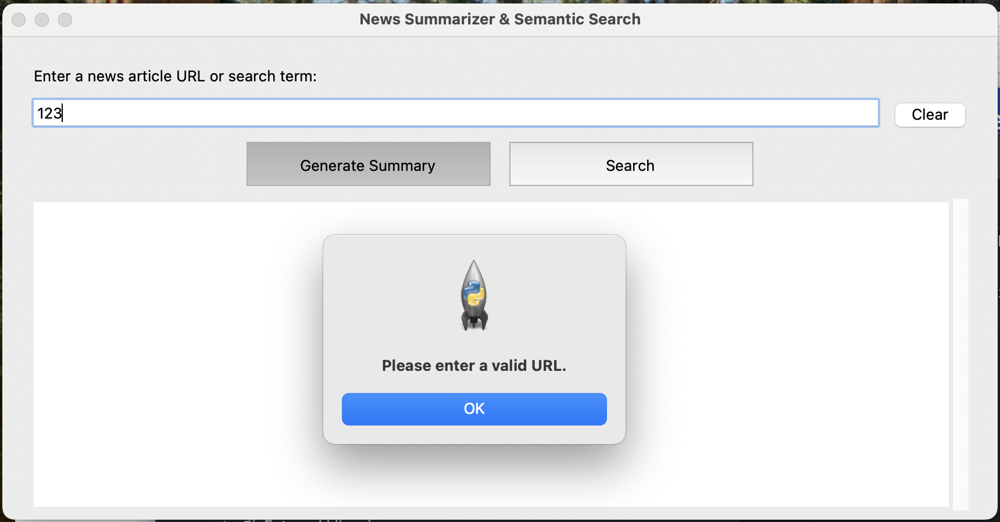
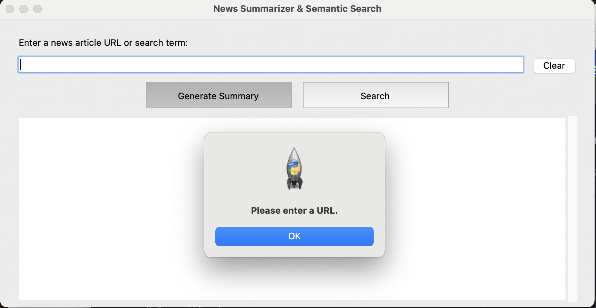
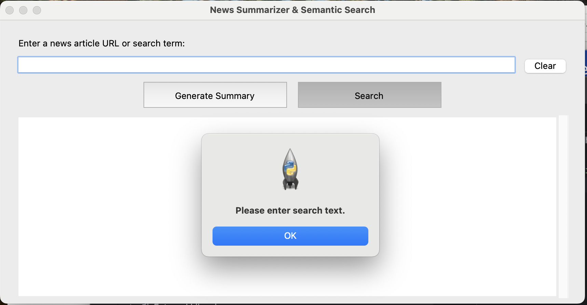
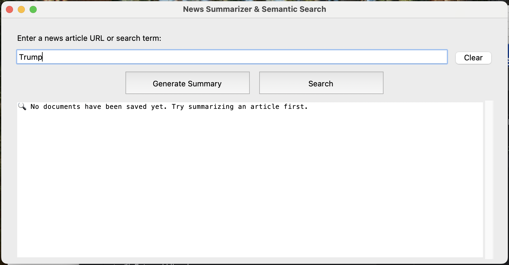
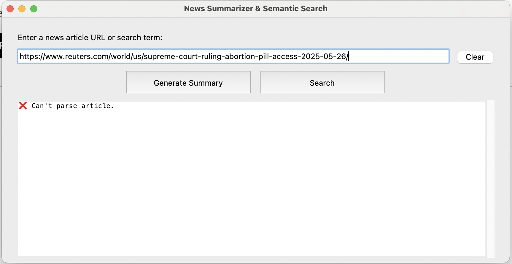
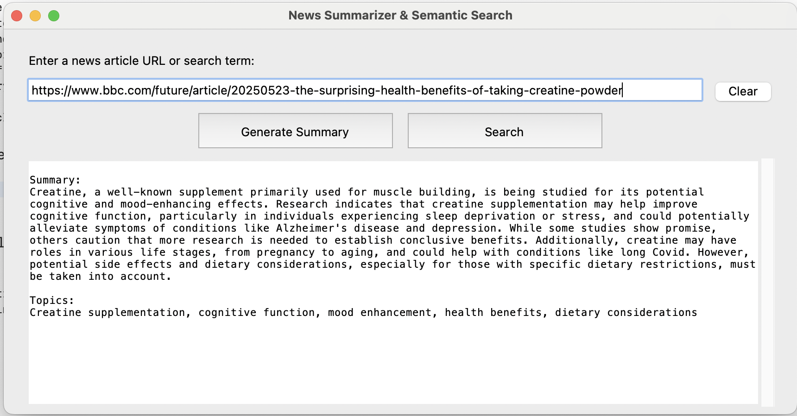
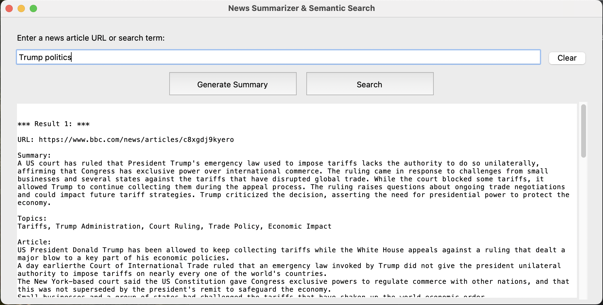

# NewsScrapper
A Python-based prototype that scrapes news articles from URLs, summarizes them using GenAI, extracts key topics, and allows semantic search via a user-friendly Tkinter GUI.

## Features

- Extract full news content from any given URL using Selenium
- Summarize article content using OpenAI's GPT
- Identify key topics from article content
- Perform fast semantic search using FAISS vector store
- User-friendly desktop GUI for end-to-end interaction

## Project Structure
    
├── main.py                  # Entry point for GUI  
├── ui.py                    # Tkinter-based UI  
├── controller.py            # Bridges UI and logic  
├── .env                     # API key  
├── requirements.txt         # Python dependencies  
├── README.md                # Project documentation  
└── logic/  
    ├── scraper.py           # Handles article extraction with Selenium + BeautifulSoup  
    ├── genai.py             # Summarizes article and extracts topics using OpenAI  
    └── semantic_store.py    # Indexes and searches summaries with FAISS  

## Requirements

- Python 3.9+
- Google Chrome (for Selenium)

## 📦 Installation

1. Clone the repository
2. Install dependencies: 
    pip install -r requirements.txt
3. Run the App: 
    - Launch the UI: python main.py
    - Paste a news URL and click "Generate Summary" to: 
        Extract article;
        Generate summary; 
        Show detected topics;
        Index and allow semantic search.
    - Paste a word/sentence to search and click "Search" to run semantic search with 3 most relevant results, where every result contains:
        A URL of the article;
        A Summary;
        Topics;
        An Article itself.
        
## 🔍 Example

Validation Results And Errors:

Article Summary:

Search Result:

## 🛠 Technologies Used

Python
Selenium + BeautifulSoup
OpenAI GPT-4o-mini
FAISS
Tkinter
python-dotenv

## 📌 Notes

Make sure Google Chrome is installed.
GUI is for prototype purposes.
